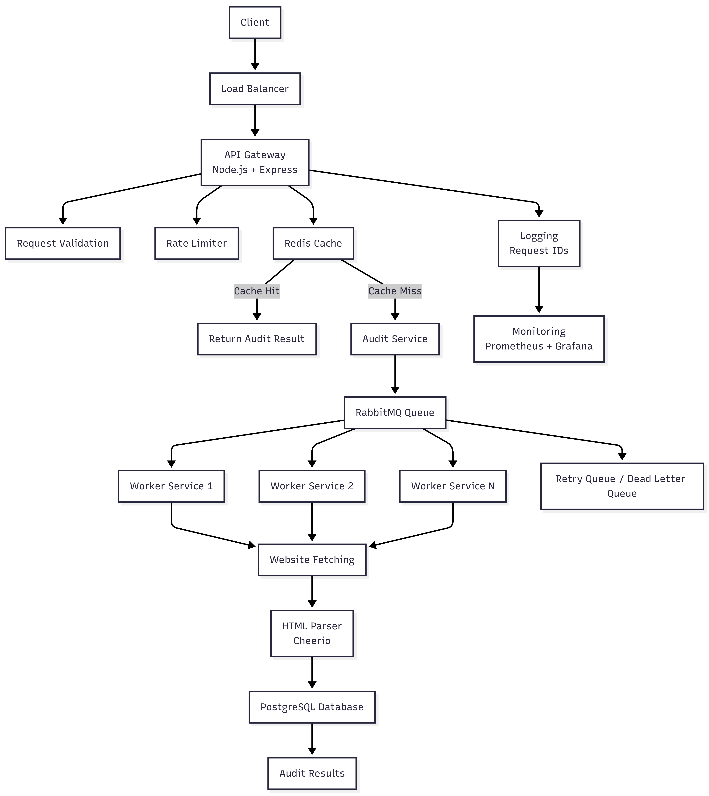

# Page Pulse - Scalable Architecture Document

## 1. Overview

Page Pulse is a production-grade URL auditing service that analyzes websites and provides audit results.

The system is designed to support:

- 10,000 audits per day
- 500 concurrent requests during traffic spikes
- Customer-facing SLA requirements
- High availability and fault tolerance

The architecture uses asynchronous processing, distributed caching, and scalable worker services.

---

# Architecture Diagram

# 2. System Components

## Client

Users send URL audit requests through REST APIs.

Responsibilities:

- Submit audit requests
- Receive audit results
- View audit history

## Load Balancer

Distributes incoming requests across multiple API instances.

Benefits:

- High availability
- Traffic distribution
- Horizontal scaling

## API Gateway

Technology:

Node.js + Express

Responsibilities:

- Request validation
- Rate limiting
- Request ID generation
- API routing
- Error handling

## Cache Layer

Technology:

Redis

Stores recently completed audit results.

Example:
URL → Audit Result
TTL → Configurable expiry window

Benefits:

- Faster response time
- Reduced repeated processing
- Lower external website requests

## Audit Service

Responsible for managing audit operations.

Responsibilities:

- Validate URLs
- Create audit jobs
- Manage audit workflow

## Message Queue

Technology:

RabbitMQ

The queue handles asynchronous processing.

Benefits:

- Handles traffic bursts
- Prevents API overload
- Provides retry mechanisms

## Worker Services

Workers perform heavy processing:

- Website fetching
- HTML parsing
- Metadata extraction
- Performance analysis

Workers can scale horizontally based on queue load.

## Database

Technology:

PostgreSQL

Stores:

- Users
- Audit history
- Audit results
- Usage information

## Monitoring System

Technology:

Prometheus + Grafana

Tracks:

- API performance
- Queue health
- Worker status
- Infrastructure metrics

# 3. Data Flow

1. Client sends URL audit request.

2. API Gateway validates the request.

3. Rate limiter checks client request limits.

4. System checks Redis cache.

5. If cached:
   - Return stored result immediately.

6. If not cached:
   - Create audit job.
   - Push job into RabbitMQ queue.

7. Worker consumes the job.

8. Worker fetches website data and performs analysis.

9. Result is stored in PostgreSQL.

10. Response is returned to the client.

# 4. Queueing Strategy

## Queue Technology

RabbitMQ

## Job Structure

Example:
{
jobId,
url,
customerId,
createdAt
}

## Retry Strategy

Failed jobs are retried:

1. Immediate retry

2. Delayed retry

3. Extended retry

Failed jobs are moved to Dead Letter Queue for investigation.

# 5. State Management

| Data | Storage |
|------|---------|
| Temporary cache | Redis |
| Audit jobs | RabbitMQ |
| Permanent audit results | PostgreSQL |
| Logs | Elasticsearch |
| Metrics | Prometheus |

# 6. SLA Target

Availability:

99.9% uptime

Response Time:

Cached audit:
< 2 seconds

New audit:
< 10 seconds

Built for Digital Heroes Training Task